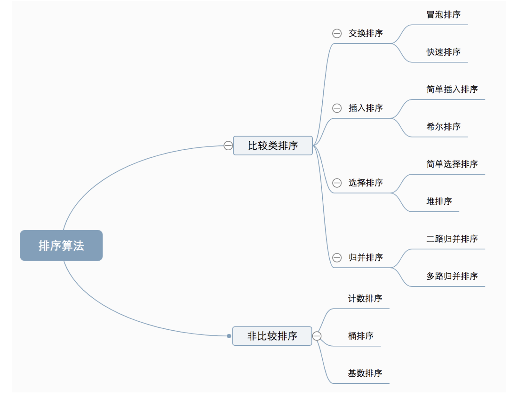

### 排序算法
1. 比较类排序  
通过比较来决定元素间的相对次序，由于其时间复杂度不能突破O(nlogn)，因此也被称为非线性时间比较类排序。  
2. 非比较类排序  
不通过比较来决定元素的相对次序，它可以突破基于比较排序的时间下界，以线性时间运行，因此也被称为线性时间非比较类排序。  

#### 初级排序O(n^2)
1. 选择排序（Selection Sort） 
每次找最小值，然后放到待排序数组的起始位置。
```
function selectionSort(arr) {
  const len = arr.length
  let minIndex
  for(let i = 0; i < len-1; i++) {
    minIndex = i
    for(let j = i + 1; j < len; j++) {
      if(arr[j] > arr[minIndex]) {
        minIndex = j
      }
    }
    [arr[i], arr[minIndex]] = [arr[minIndex], arr[i]]
  }
  return arr
}
```
2. 插入排序（Insertion Sort） 
从前向后逐步构建有序序列；对于未排序数据，在已排序序列中从后往前扫描，找到相应位置插入。
```
function insertionSort(arr) {
  const len = arr.length
  let preIndex, current
  for(let i = 1; i < len; i++) {
    preIndex = i-1
    current = arr[i]
    while(preIndex >=0 && arr[preIndex] > current) {
      arr[preIndex+1] = arr[preIndex]
      preIndex--
    }
    arr[preIndex+1] = current
  }
  return arr
}
```
3. 冒泡排序（Bubble Sort） 
嵌套循环，每次查看相邻的元素，如果逆序就交换。
```
function bubbleSort(arr) {
  const len = arr.length
  let swapFlag = false
  for(let i = 0; i < len-1; i++) {
    for(let j = 0; j < len-i-1; j++) {
      if(arr[j] > arr[j+1]) {
        [arr[j], arr[j+1]] = [arr[j+1], arr[j]]
        swapFlag = true
      }
    }
    if(!swapFlag) {
      break
    }
  }
  return arr
}
```
#### 高级排序O(n*logn)
1. 快速排序（Quick Sort） 
数组取标杆pivot，将小元素放在pivot左边，大于其则放在右侧，然后依次对右边和右边的子数组继续快排；以达到整个序列有序。 
```
function partition(arr, left, right) {
  let pivot = left, index = pivot+1
  for(let i = index; i <= right; i++) {
    if(arr[i] < arr[pivot]) {
      [arr[i], arr[index]] = [arr[index], arr[i]]
      index++
    }
  }
  [arr[pivot], arr[index-1]] = [arr[index-1], arr[pivot]]
  return index-1
}
function quickSort(arr, left=0, right) {
  const len = arr.length
  if(!len || len === 1) {
    return arr
  }
  right = right || len-1
  if(left < right) {
    let partitionIndex = partition(arr, left, right)
    quickSort(arr, left, partitionIndex-1)
    quickSort(arr, partitionIndex+1, right)
  }
  return arr
}
```
2. 归并排序（Merge Sort） 
分治法的应用，将已有序的子序列合并，得到有序的序列：即先使每个子序列有序，再使子序列间有序。若将两个有序表合并为一个有序表，为2-路归并。  
```
function merge(left, right) {
  const result = []
  while(left.length && right.length) {
    if(left[0] <= right[0]) {
      result.push(left.shift())
    } else {
      result.push(right.shift())
    }
  }
  while(left.length) {
    result.push(left.shift())
  }
  while(right.length) {
    result.push(right.shift())
  }
  return result
}
function mergeSort(arr) {
  const len = arr.length
  if(len < 2) {
    return arr
  }
  const middle = Math.floor(len/2),
  left = arr.slice(0, middle),
  right = arr.slice(middle)
  return merge(mergeSort(left), mergeSort(right))
}
```
3. 堆排序